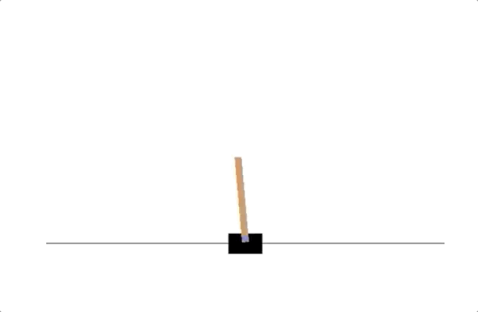

# Hill Climbing

-------
This project is a part of [Udacity Deep Reinforcement Learning Nanodegree](https://www.udacity.com/course/deep-reinforcement-learning-nanodegree--nd893). Follow the instructions in `Hill_Climbing.ipynb` to see an implementation of hill climbing with adaptive noise scaling with OpenAI Gym's Cartpole environment.